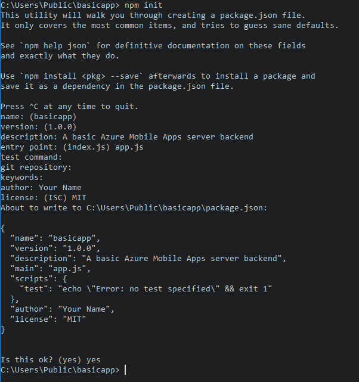

# How to use the Node.js backend Server SDK

This article provides detailed information and examples that show how to work with a NodeJS backend for Azure Mobile Apps.

## Introduction

Azure Mobile Apps provides the capability to add a mobile-optimized data access Web API to a web application. The Azure Mobile Apps SDK is provided for ASP.NET Framework and Node.js web applications. The SDK provides the following operations:

* Table operations (read, insert, update, delete) for data access
* Custom API operations

Both operations provide for authentication across all identity providers that Azure App Service allows. These providers include social identity providers such as Facebook, Twitter, Google, and Microsoft, as well as Azure Active Directory for enterprise identity.

## Supported platforms

The Azure Mobile Apps Node.js SDK supports the Node 6.x and later, and has been tested up to Node 12.x. Other versions of Node might work but are not supported.

The Azure Mobile Apps Node.js SDK supports two database drivers: 

* The node-mssql driver supports Azure SQL Database and local SQL Server instances.  
* The sqlite3 driver supports SQLite databases on a single instance only.

### Create a basic Node back end by using the command line

Every Azure Mobile Apps Node.js back end starts as an [Express](http://expressjs.com) application. Express is the most popular web service framework available for Node.js. You can create a basic [Express](https://expressjs.com) application as follows:

1. In a command or PowerShell window, create a directory for your project:

    ``` bash
    $ mkdir basicapp
    ```

1. Run `npm init` to initialize the package structure:

    ``` bash
    $ cd basicapp
    $ npm init
    ```

   The `npm init` command asks a set of questions to initialize the project. See the example output:

   

1. Install the `express` and `azure-mobile-apps` libraries from the npm repository:

        npm install --save express azure-mobile-apps

1. Create an `app.js` file to implement the basic mobile server:

    ``` javascript
    var express = require('express'),
        azureMobileApps = require('azure-mobile-apps');

    var app = express(),
        mobile = azureMobileApps();

    // Define a TodoItem table.
    mobile.tables.add('TodoItem');

    // Add the Mobile API so it is accessible as a Web API.
    app.use(mobile);

    // Start listening on HTTP.
    app.listen(process.env.PORT || 3000);
    ```

This application creates a mobile-optimized Web API with a single endpoint (`/tables/TodoItem`) that provides unauthenticated access to an underlying SQL data store by using a dynamic schema. It is suitable for following the client library quickstarts:

* [Android](../../quickstarts/android/index.md)
* [Apache Cordova](../../quickstarts/cordova/index.md)
* [iOS](../../quickstarts/ios/index.md)
* [Windows (UWP)](../../quickstarts/uwp/index.md)
* [Windows (WPF)](../../quickstarts/wpf/index.md)
* [Xamarin.Android](../../quickstarts/xamarin-android/index.md)
* [Xamarin.Forms](../../quickstarts/xamarin-forms/index.md)
* [Xamarin.iOS](../../quickstarts/xamarin-ios/index.md)

You can find the code for this basic application in the [samples area on GitHub](https://github.com/azure/azure-mobile-apps/tree/master/samples/nodejs).

### Enable a home page for your application

Many applications are a combination of web and mobile apps. You can use the Express framework to combine the two facets. Sometimes, however, you might want to only implement a mobile interface. It's useful to provide a home page to ensure that the app service is up and running. You can either provide your own home page or enable a temporary home page. To enable a temporary home page, use the following code to instantiate Azure Mobile Apps:

``` javascript
var mobile = azureMobileApps({ homePage: true });
```

If you only want this option available when developing locally, you can add this setting to the `azureMobile.js` configuration file:

``` javascript
module.exports = {
    homePage: true,
};
```

You can add other settings to the azureMobile.js file, as required.

## Table operations

The azure-mobile-apps Node.js Server SDK provides mechanisms to expose data tables stored in Azure SQL Database as a Web API. It provides five operations:

| Operation | Description |
| --- | --- |
| GET /tables/*tablename* |Get all records in the table. |
| GET /tables/*tablename*/:id |Get a specific record in the table. |
| POST /tables/*tablename* |Create a record in the table. |
| PATCH /tables/*tablename*/:id |Update a record in the table. |
| DELETE /tables/*tablename*/:id |Delete a record in the table. |

This Web API supports [OData v3](https://www.odata.org) and extends the table schema to support [offline data sync](../datasync.md).

### Define tables by using a dynamic schema

Before you can use a table, you must define it. You can define tables by using a static schema (where you define the columns in the schema) or dynamically (where the SDK controls the schema based on incoming requests). In addition, you can control specific aspects of the Web API by adding JavaScript code to the definition.

As a best practice, you should define each table in a JavaScript file in the `tables` directory, and then use the `tables.import()` method to import the tables. Extending the basic-app sample, you would adjust the app.js file:

```javascript
var express = require('express'),
    azureMobileApps = require('azure-mobile-apps');

var app = express(),
    mobile = azureMobileApps();

// Define the database schema that is exposed.
mobile.tables.import('./tables');

// Provide initialization of any tables that are statically defined.
mobile.tables.initialize().then(function () {
    // Add the Mobile API so it is accessible as a Web API.
    app.use(mobile);

    // Start listening on HTTP.
    app.listen(process.env.PORT || 3000);
});
```

Define the table in ./tables/TodoItem.js:

```javascript
var azureMobileApps = require('azure-mobile-apps');

var table = azureMobileApps.table();

// Additional configuration for the table goes here.

module.exports = table;
```

Tables use a dynamic schema by default. 

### Define tables by using a static schema

You can explicitly define the columns to expose via the Web API. The azure-mobile-apps Node.js SDK automatically adds any extra columns required for offline data sync to the list that you provide. For example, the quickstart client applications require a table with two columns: `text` (a string) and `complete` (a Boolean).   The table can be defined in the table definition JavaScript file (located in the `tables` directory) as follows:

```javascript
var azureMobileApps = require('azure-mobile-apps');

var table = azureMobileApps.table();

// Define the columns within the table.
table.columns = {
    "text": "string",
    "complete": "boolean"
};

// Turn off the dynamic schema.
table.dynamicSchema = false;

module.exports = table;
```

If you define tables statically, you must also call the `tables.initialize()` method to create the database schema on startup. The `tables.initialize()` method returns a [promise](https://developer.mozilla.org/docs/Web/JavaScript/Reference/Global_Objects/Promise) so that the web service does not serve requests before the database is initialized.

### Use SQL Server Express as a development data store on your local machine

The Azure Mobile Apps Node.js SDK provides three options for serving data out of the box:

* Use the **memory** driver to provide a non-persistent example store.
* Use the **mssql** driver to provide a SQL Server Express data store for development.
* Use the **mssql** driver to provide an Azure SQL Database data store for production.

The Azure Mobile Apps Node.js SDK uses the [mssql Node.js package](https://www.npmjs.com/package/mssql) to establish and use a connection to both SQL Server Express and SQL Database. This package requires that you enable TCP connections on your SQL Server Express instance.

> [!TIP]
> The memory driver does not provide a complete set of facilities for testing. If you want to test
> your back end locally, we recommend the use of a SQL Server Express data store and the mssql driver.

1. Download and install [Microsoft SQL Server 2019 Developer](https://www.microsoft.com/sql-server/sql-server-downloads). 
1. Run Configuration Manager:

   a. Expand the **SQL Server Network Configuration** node in the tree menu.

   b. Select **Protocols for <instance-name>**.

   c. Right-click **TCP/IP** and select **Enable**. Select **OK** in the pop-up dialog box.

   d. Select **SQL Server Services** in the tree menu.

   e. Right-click **SQL Server (<instance-name>)** and select **Restart**.

   j. Close Configuration Manager.

You will also have to create a username and password that Azure Mobile Apps can use to connect to the database.  Ensure the user you create has the `dbcreator` server role.  For more information on configuring users, consult the [SQL Server documentation](https://docs.microsoft.com/sql/relational-databases/security/authentication-access/create-a-database-user?view=sql-server-ver15)

Be sure to record the username and password that you selected. You  might need to assign additional server roles or permissions, depending on your database requirements.

The Node.js application reads the `SQLCONNSTR_MS_TableConnectionString` environment variable for
the connection string for this database. You can set this variable in your environment. For example, you can use PowerShell to set this environment variable:

``` powershell
$env:SQLCONNSTR_MS_TableConnectionString = "Server=127.0.0.1; Database=mytestdatabase; User Id=azuremobile; Password=T3stPa55word;"
```

Access the database through a TCP/IP connection. Provide a username and password for the connection.

### Configure your project for local development

Azure Mobile Apps reads a JavaScript file called `azureMobile.js` from the local file system. Do not use this file to configure the Azure Mobile Apps SDK in production. Instead, use [**App settings** in the Azure portal](https://docs.microsoft.com/azure/app-service/configure-common).

The azureMobile.js file should export a configuration object. The most common settings are:

* Database settings
* Diagnostic logging settings
* Alternate CORS settings

This example **azureMobile.js** file implements the preceding database settings:

```javascript
module.exports = {
    cors: {
        origins: [ 'localhost' ]
    },
    data: {
        provider: 'mssql',
        server: '127.0.0.1',
        database: 'mytestdatabase',
        user: 'azuremobile',
        password: 'T3stPa55word'
    },
    logging: {
        level: 'verbose'
    }
};
```

We recommend that you add `azureMobile.js` to your `.gitignore` file (or other source code control ignore file) to prevent passwords from being stored in the cloud.

### Configure app settings for your mobile app

Most settings in the `azureMobile.js` file have an equivalent app setting in the [Azure portal](https://portal.azure.com). Use the following list to configure your app in **App settings**:

| App setting | azureMobile.js setting | Description | Valid values |
|:--- |:--- |:--- |:--- |
| **MS_MobileAppName** |name |Name of the app |string |
| **MS_MobileLoggingLevel** |logging.level |Minimum log level of messages to log |error, warning, info, verbose, debug, silly |
| **MS_DebugMode** |debug |Enables or disables debug mode |true, false |
| **MS_TableSchema** |data.schema |Default schema name for SQL tables |string (default: dbo) |
| **MS_DynamicSchema** |data.dynamicSchema |Enables or disables debug mode |true, false |
| **MS_DisableVersionHeader** |version (set to undefined) |Disables the X-ZUMO-Server-Version header |true, false |
| **MS_SkipVersionCheck** |skipversioncheck |Disables the client API version check |true, false |

Changing most app settings requires a service restart.

### Use Azure SQL as your production data store

Using Azure SQL Database as a data store is identical across all Azure App Service application types. If you have not done so already, follow these steps to create an Azure App Service back end.  Create an Azure SQL instance, then set the app setting `SQLCONNSTR_MS_TableConnectionString` to the connection string for the Azure SQL instance you wish to use.  Ensure that the Azure App Service that is running your back end can communicate with your Azure SQL instance.

### Require authentication for access to tables

If you want to use App Service Authentication with the `tables` endpoint, you must [configure App Service Authentication in the Azure portal](https://docs.microsoft.com/azure/app-service/app-service-authentication-how-to) first. For more information, see the configuration guide for the identity provider that you intend to use:

* [Configure Azure Active Directory authentication](https://docs.microsoft.com/azure/app-service/configure-authentication-provider-aad)
* [Configure Facebook authentication](https://docs.microsoft.com/azure/app-service/configure-authentication-provider-facebook)
* [Configure Google authentication](https://docs.microsoft.com/azure/app-service/configure-authentication-provider-google)
* [Configure Microsoft authentication](https://docs.microsoft.com/azure/app-service/configure-authentication-provider-microsoft)
* [Configure Twitter authentication](https://docs.microsoft.com/azure/app-service/configure-authentication-provider-twitter)

Each table has an access property that you can use to control access to the table. The following sample shows a statically defined table with authentication required.

```javascript
var azureMobileApps = require('azure-mobile-apps');

var table = azureMobileApps.table();

// Define the columns within the table.
table.columns = {
    "text": "string",
    "complete": "boolean"
};

// Turn off the dynamic schema.
table.dynamicSchema = false;

// Require authentication to access the table.
table.access = 'authenticated';

module.exports = table;
```

The access property can take one of three values:

* *anonymous* indicates that the client application is allowed to read data without authentication.
* *authenticated* indicates that the client application must send a valid authentication token with the request.
* *disabled* indicates that this table is currently disabled.

If the access property is undefined, unauthenticated access is allowed.

### Use authentication claims with your tables
You can set up various claims that are requested when authentication is set up. These claims are not normally available through the `context.user` object. However, you can retrieve them by using the `context.user.getIdentity()` method. The `getIdentity()` method returns a promise that resolves to an object. The object is keyed by the authentication method (`facebook`, `google`, `twitter`, `microsoftaccount`, or `aad`).

> **Note** If using Microsoft authentication via Azure Active Directory, the authentication method is `aad`, not `microsoftaccount`.

For example, if you set up Azure Active Directory authentication and request the email addresses claim, you can add the email address to the record with the following table controller:

```javascript
var azureMobileApps = require('azure-mobile-apps');

// Create a new table definition.
var table = azureMobileApps.table();

table.columns = {
    "emailAddress": "string",
    "text": "string",
    "complete": "boolean"
};
table.dynamicSchema = false;
table.access = 'authenticated';

/**
* Limit the context query to those records with the authenticated user email address
* @param {Context} context the operation context
* @returns {Promise} context execution Promise
*/
function queryContextForEmail(context) {
    return context.user.getIdentity().then((data) => {
        context.query.where({ emailAddress: data.aad.claims.emailaddress });
        return context.execute();
    });
}

/**
* Adds the email address from the claims to the context item - used for
* insert operations
* @param {Context} context the operation context
* @returns {Promise} context execution Promise
*/
function addEmailToContext(context) {
    return context.user.getIdentity().then((data) => {
        context.item.emailAddress = data.aad.claims.emailaddress;
        return context.execute();
    });
}

// Configure specific code when the client does a request.
// READ: only return records that belong to the authenticated user.
table.read(queryContextForEmail);

// CREATE: add or overwrite the userId based on the authenticated user.
table.insert(addEmailToContext);

// UPDATE: only allow updating of records that belong to the authenticated user.
table.update(queryContextForEmail);

// DELETE: only allow deletion of records that belong to the authenticated user.
table.delete(queryContextForEmail);

module.exports = table;
```

To see what claims are available, use a web browser to view the `/.auth/me` endpoint of your site.

### Disable access to specific table operations

In addition to appearing on the table, the access property can be used to control individual operations. There are four operations:

* `read` is the RESTful GET operation on the table.
* `insert` is the RESTful POST operation on the table.
* `update` is the RESTful PATCH operation on the table.
* `delete` is the RESTful DELETE operation on the table.

For example, you might want to provide a read-only unauthenticated table:

```javascript
var azureMobileApps = require('azure-mobile-apps');

var table = azureMobileApps.table();

// Read-only table. Only allow READ operations.
table.read.access = 'anonymous';
table.insert.access = 'disabled';
table.update.access = 'disabled';
table.delete.access = 'disabled';

module.exports = table;
```

### Adjust the query that is used with table operations

A common requirement for table operations is to provide a restricted view of the data. For example, you can provide a table that is tagged with the authenticated user ID such that you can only read or update your own records. The following table definition provides this functionality:

```javascript
var azureMobileApps = require('azure-mobile-apps');

var table = azureMobileApps.table();

// Define a static schema for the table.
table.columns = {
    "userId": "string",
    "text": "string",
    "complete": "boolean"
};
table.dynamicSchema = false;

// Require authentication for this table.
table.access = 'authenticated';

// Ensure that only records for the authenticated user are retrieved.
table.read(function (context) {
    context.query.where({ userId: context.user.id });
    return context.execute();
});

// When adding records, add or overwrite the userId with the authenticated user.
table.insert(function (context) {
    context.item.userId = context.user.id;
    return context.execute();
});

module.exports = table;
```

Operations that normally run a query have a query property that you can adjust by using a `where` clause. The query property is a [QueryJS](https://github.com/Azure/queryjs) object that is used to convert an OData query to something that the data back end can process. For simple equality cases (like the preceding one), you can use a map. You can also add specific SQL clauses:

```javascript
context.query.where('myfield eq ?', 'value');
```

### Configure a soft delete on a table

A soft delete does not actually delete records. Instead it marks them as deleted within the database by setting the deleted column to true. The Azure Mobile Apps SDK automatically removes soft-deleted records from results unless the Mobile Client SDK uses `includeDeleted()`. To configure a table for a soft delete, set the `softDelete` property in the table definition file:

```javascript
var azureMobileApps = require('azure-mobile-apps');

var table = azureMobileApps.table();

// Define the columns within the table.
table.columns = {
    "text": "string",
    "complete": "boolean"
};

// Turn off the dynamic schema.
table.dynamicSchema = false;

// Turn on soft delete.
table.softDelete = true;

// Require authentication to access the table.
table.access = 'authenticated';

module.exports = table;
```

You should establish a mechanism for deleting records: a client application, a WebJob, an Azure Function, or a custom API.

### Seed your database with data

When you're creating a new application, you might want to seed a table with data. You can do this within the table definition JavaScript file as follows:

```javascript
var azureMobileApps = require('azure-mobile-apps');

var table = azureMobileApps.table();

// Define the columns within the table.
table.columns = {
    "text": "string",
    "complete": "boolean"
};
table.seed = [
    { text: 'Example 1', complete: false },
    { text: 'Example 2', complete: true }
];

// Turn off the dynamic schema.
table.dynamicSchema = false;

// Require authentication to access the table.
table.access = 'authenticated';

module.exports = table;
```

Seeding of data happens only when you've used the Azure Mobile Apps SDK to create the table. If the table already exists in the database, no data is injected into the table. If the dynamic schema is turned on, the schema is inferred from the seeded data.

We recommend that you explicitly call the `tables.initialize()` method to create the table when the service starts running.

### Enable Swagger support
Azure Mobile Apps comes with built-in [Swagger](https://swagger.io/) support. To enable Swagger support, first install swagger-ui as a dependency:

``` bash
npm install --save swagger-ui
```

You can then enable Swagger support in the Azure Mobile Apps constructor:

```javascript
var mobile = azureMobileApps({ swagger: true });
```

You probably only want to enable Swagger support in development editions. You can do this by using the `NODE_ENV` app setting:

```javascript
var mobile = azureMobileApps({ swagger: process.env.NODE_ENV !== 'production' });
```

The `swagger` endpoint is located at http://*yoursite*.azurewebsites.net/swagger. You can access the Swagger UI via the `/swagger/ui` endpoint. If you choose to require authentication across your entire application, Swagger produces an error. For best results, choose to allow unauthenticated requests in the Azure App Service Authentication/Authorization settings, and then control authentication by using the `table.access` property.

You can also add the Swagger option to your `azureMobile.js` file if you only want Swagger support for developing locally.

## <a name="CustomAPI"></a> Custom APIs

In addition to the Data Access API via the `/tables` endpoint, Azure Mobile Apps can provide custom API coverage. Custom APIs are defined in a similar way to the table definitions and can access all the same facilities, including authentication.

### <a name="howto-customapi-basic"></a>Define a custom API

Custom APIs are defined in much the same way as the Tables API:

1. Create an `api` directory.
1. Create an API definition JavaScript file in the `api` directory.
1. Use the import method to import the `api` directory.

Here is the prototype API definition based on the basic-app sample that we used earlier:

```javascript
var express = require('express'),
    azureMobileApps = require('azure-mobile-apps');

var app = express(),
    mobile = azureMobileApps();

// Import the custom API.
mobile.api.import('./api');

// Add the Mobile API so it is accessible as a Web API.
app.use(mobile);

// Start listening on HTTP
app.listen(process.env.PORT || 3000);
```

Let's take an example API that returns the server date by using the `Date.now()` method. Here is the `api/date.js` file:

```javascript
var api = {
    get: function (req, res, next) {
        var date = { currentTime: Date.now() };
        res.status(200).type('application/json').send(date);
    });
};

module.exports = api;
```

Each parameter is one of the standard RESTful verbs: GET, POST, PATCH, or DELETE. The method is a standard [ExpressJS middleware](http://expressjs.com/en/guide/using-middleware.html) function that sends the required output.

### Require authentication for access to a custom API

The Azure Mobile Apps SDK implements authentication in the same way for both the `tables` endpoint and custom APIs. To add authentication to the API developed in the previous section, add an `access` property:

```javascript
var api = {
    get: function (req, res, next) {
        var date = { currentTime: Date.now() };
        res.status(200).type('application/json').send(date);
    });
};
// All methods must be authenticated.
api.access = 'authenticated';

module.exports = api;
```

You can also specify authentication on specific operations:

```javascript
var api = {
    get: function (req, res, next) {
        var date = { currentTime: Date.now() };
        res.status(200).type('application/json').send(date);
    }
};
// The GET methods must be authenticated.
api.get.access = 'authenticated';

module.exports = api;
```

The same token that is used for the `tables` endpoint must be used for custom APIs that require authentication.

### Handle large file uploads

The Azure Mobile Apps SDK uses the [body-parser middleware](https://github.com/expressjs/body-parser) to accept and decode body content in your submission. You can preconfigure body-parser to accept larger file uploads:

```javascript
var express = require('express'),
    bodyParser = require('body-parser'),
    azureMobileApps = require('azure-mobile-apps');

var app = express(),
    mobile = azureMobileApps();

// Set up large body content handling.
app.use(bodyParser.json({ limit: '50mb' }));
app.use(bodyParser.urlencoded({ limit: '50mb', extended: true }));

// Import the custom API.
mobile.api.import('./api');

// Add the Mobile API so it is accessible as a Web API.
app.use(mobile);

// Start listening on HTTP.
app.listen(process.env.PORT || 3000);
```

The file is base-64 encoded before transmission. This encoding increases the size of the actual upload (and the size that you must account for).

### Execute custom SQL statements

The Azure Mobile Apps SDK allows access to the entire context through the request object. You can easily execute parameterized SQL statements to the defined data provider:

```javascript
var api = {
    get: function (request, response, next) {
        // Check for parameters. If not there, pass on to a later API call.
        if (typeof request.params.completed === 'undefined')
            return next();

        // Define the query. Anything that the mssql
        // driver can handle is allowed.
        var query = {
            sql: 'UPDATE TodoItem SET complete=@completed',
            parameters: [{
                completed: request.params.completed
            }]
        };

        // Execute the query. The context for Azure Mobile Apps is available through
        // request.azureMobile. The data object contains the configured data provider.
        request.azureMobile.data.execute(query)
        .then(function (results) {
            response.json(results);
        });
    }
};

api.get.access = 'authenticated';
module.exports = api;
```

## Debugging

### Debug, diagnose, and troubleshoot Azure Mobile Apps

Azure App Service provides several debugging and troubleshooting techniques for Node.js applications. To get started in troubleshooting your Node.js Azure Mobile Apps back end, see the following articles:

* [Monitoring Azure App Service](https://docs.microsoft.com/azure/app-service/web-sites-monitor)
* [Enable diagnostic logging in Azure App Service](https://docs.microsoft.com/azure/app-service/troubleshoot-diagnostic-logs)
* [Troubleshoot node applications on Azure App Service](https://docs.microsoft.com/azure/app-service/app-service-web-nodejs-best-practices-and-troubleshoot-guide)

Node.js applications have access to a wide range of diagnostic log tools. Internally, the Azure Mobile Apps Node.js SDK uses [Winston] for diagnostic logging. Logging is automatically enabled when you enable debug mode or set the `MS_DebugMode` app setting to true in the Azure portal. Generated logs appear in the diagnostic logs in the Azure portal.

