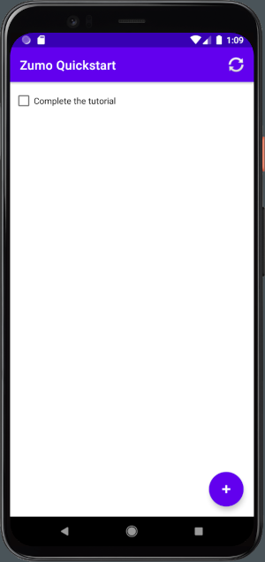

# Create an Android app

This tutorial shows you how to add a cloud-based backend service to an Android mobile app by using an Azure mobile app backend.  You will create both a new mobile app backend and a simple *Todo list* Android app that stores app data in Azure.

Completing this tutorial is a prerequisite for all other Android tutorials about using the Mobile Apps feature in Azure App Service.

## Prerequisites

To complete this tutorial, you need the following:

* [Android Studio 4.1.1](https://developer.android.com/sdk/index.html).
* A suitable SDK, which can be installed from the [SDK Manager](https://developer.android.com/studio/intro/update).
  * Android 8.1 (Oreo) > Android SDK Platform 27
  * Android 8.1 (Oreo) > Google Play Intel x86 Atom System Image
* An [Android Virtual Device](https://developer.android.com/studio/run/managing-avds), with the following settings:
  * Phone: Pixel 4 (includes Play Store)
  * System Image: Oreo (API 27, x86, Google Play)
* An [Azure account](https://azure.microsoft.com/pricing/free-trial).
* The [Azure CLI](https://docs.microsoft.com/cli/azure/install-azure-cli).
    * [Log into your Azure account](https://docs.microsoft.com/cli/azure/authenticate-azure-cli) and [select a subscription](https://docs.microsoft.com/cli/azure/manage-azure-subscriptions-azure-cli) using the Azure CLI.

You can complete this tutorial on Mac, Linux, or Windows.

## Download the Android quickstart project

The Android quickstart project is located in the `samples/android` folder of the [azure/azure-mobile-apps](https://github.com/azure/azure-mobile-apps) GitHub repository.  You can clone the repository using a command line:

```bash
# This will create a folder called azure-mobile-apps in the current directory
git clone https://github.com/azure/azure-mobile-apps
```

Or you can [download the repository as a ZIP file](https://github.com/Azure/azure-mobile-apps/archive/master.zip), then unpack it.  The files will be created in the `azure-mobile-apps-master` folder.

Once downloaded, open a Terminal and change directory to the location of the files.

## Deploy the backend service

To deploy the quickstart service, first login to Azure with the Azure CLI:

```bash
> az login
```

A web browser will be opened to complete the authorization.

If necessary, [select a subscription](https://docs.microsoft.com/cli/azure/manage-azure-subscriptions-azure-cli).

### Create a resource group

Type the following to create a resource group:

```bash
> az group create -l westus -n zumo-quickstart
```

This will create a resource group called _zumo-quickstart_ to hold all the resources we create.  

### Deploy the backend to Azure

The service is comprised of the following resources:

* An App Service Hosting Plan on the Free plan.
* A web-site hosted within the App Service Hosting plan.
* An Azure SQL server
* An Azure SQL database in the Basic tier (incurs cost)

The only item that incurs cost if the Azure SQL database.  For details, see [Pricing](https://azure.microsoft.com/en-us/pricing/details/sql-database/single/).

To deploy the resources, type the following:

```bash
> cd samples/nodejs
> az deployment group create -n ZumoQuickstart -g zumo-quickstart --template-file ./azuredeploy.json
```

> **Deployment Failed**
> If the deployment failed, but all the resources seem to be created, it is likely that the deployment of the backend code failed.  To check this, log onto the Azure portal, then locate your App Service (in the _zumo-quickstart_ resource group).  Select **Deployment Center**.  If the deployment is listed as failed, press the **Sync** button to re-try the deployment.

Once complete, run the following to see the outputs:

```bash
az deployment group create -n ZumoQuickstart -g zumo-quickstart --query properties.output
```

This will show the password for your database and the URI of the backend are printed.  You will need the URI when configuring your mobile app.  You do not require the password for your database.  However, it is useful if you wish to inspect the database through the Azure portal.

> **Deleting the resources**
>
> Once you have completed the quickstart tutorial, you can delete the resources with `az group delete -n zumo-quickstart`.
> 
> The tutorial is comprised of four parts (including this section).  Do not delete the resources before completing the tutorial.

## Configure the Android quickstart project

Open the Android project (located at `samples/android`).  Edit the `Configuration.java` file to replace the `BackendUrl` with your backend URL.  For example, if your backend URL was `https://web-abcd1234.azurewebsites.net`, then the file would look like this:

```java
package com.example.zumoquickstart;

public class Configuration {
    /**
     * The Url to your ZUMO Backend
     */
    public static String BackendUrl = "https://web-abcd1234.azurewebsites.net";
}
```

Save the file, then build your application.

## Run the Android app

In the top bar, select the AVD that you created (for example, `Pixel 4 API 27`), then press the Run button next to the AVD selector.

Once the app starts, type some text, such as *Complete the tutorial*, then click 'Add'.  This will insert the text into the TodoItem SQL table you created earlier, and displays the text in the list.


