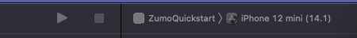
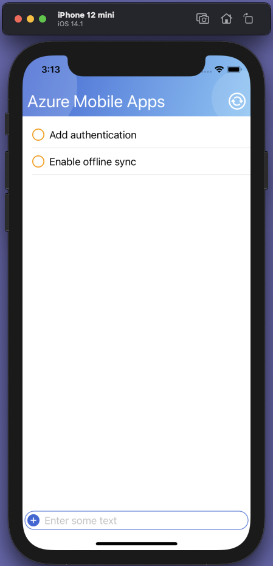

# Create an iOS (SwiftUI) app

This tutorial shows you how to add a cloud-based backend service to an iOS mobile app by using an Azure mobile app backend.  You will create both a new mobile app backend and a simple *Todo list* iOS app that stores app data in Azure.

Completing this tutorial is a prerequisite for all other iOS tutorials about using the Mobile Apps feature in Azure App Service.

## Prerequisites

To complete this tutorial, you need the following:

* [XCode](https://developer.apple.com/xcode/) v12 or later (earlier versions may work)
* An [iOS 14.1 simulator](https://www.macinstruct.com/tutorials/setting-up-an-ios-simulator-on-your-mac/) installed.
* [CocoaPods](https://cocoapods.org) installed
* An [Azure account](https://azure.microsoft.com/pricing/free-trial).
* The [Azure CLI](https://docs.microsoft.com/cli/azure/install-azure-cli).
    * [Log into your Azure account](https://docs.microsoft.com/cli/azure/authenticate-azure-cli) and [select a subscription](https://docs.microsoft.com/cli/azure/manage-azure-subscriptions-azure-cli) using the Azure CLI.

You must complete this tutorial on a Mac.

## Download the iOS quickstart project

The Android quickstart project is located in the `samples/ios` folder of the [azure/azure-mobile-apps](https://github.com/azure/azure-mobile-apps) GitHub repository.  You can [download the repository as a ZIP file](https://github.com/Azure/azure-mobile-apps/archive/master.zip), then unpack it.  The files will be created in the `azure-mobile-apps-master` folder.

Once downloaded, open a Terminal and change directory to the location of the files.

{!quickstarts/includes/quickstart-deploy-backend.md!}

## Configure the iOS quickstart project

Open the `ZumoQuickstart.xcworkspace` project in XCode (located at `samples/ios`).  Edit the `Constants.swift` class to replace the `BackendURL` with your backend URL.  For example, if your backend URL was `https://zumo-abcd1234.azurewebsites.net`, then the file would look like this:

``` swift
import Foundation

class Constants {
    static let BackendURL = "https://zumo-abcd1234.azurewebsites.net"
}

```

Save the file, then build your application.

## Run the iOS app

In the top bar, select a suitable simulator (for example, **iPhone 12 mini (14.1)**), then press the Run button.



Once the app starts, enter some text in the box at the bottom of the simulator screen, then press Enter on the virtual keyboard.  You can also press on the circle next to any item to toggle the "completed" flag.  The data is persisted to the backend.


